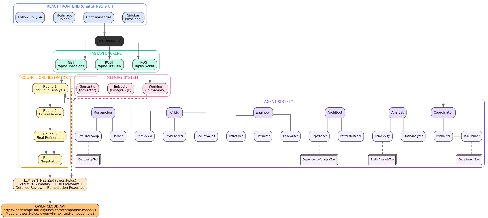

# Multi-Agent Council — System Architecture

## Overview

Multi-Agent Council is a **multi-agent Agent Society** deployed on Alibaba Cloud ECS, powered by Qwen Cloud APIs. Six role-based core agents with 15 specialised sub-agents and 4 tools collaborate via structured debate rounds to perform code review and answer questions.



---

## Agent Society Architecture

### Core Agents (6)

| Agent | Role | Sub-agents | Tools |
|:------|:-----|:-----------|:------|
| **Coordinator** | Orchestrates workflow, delegates tasks | TaskPlanner, PriorityRouter | CodeSearch, StaticAnalysis, DependencyAnalysis, DocLookup |
| **Analyst** | Examines code, detects patterns, analyses complexity | StaticAnalyzer, PatternDetector, ComplexityAnalyzer | CodeSearch, StaticAnalysis |
| **Architect** | Designs solutions, plans structure, maps dependencies | DesignPatternMatcher, DependencyMapper | DependencyAnalysis, DocLookup |
| **Engineer** | Implements fixes, writes code, optimises | CodeWriter, Refactorer, Optimizer | CodeSearch |
| **Critic** | Reviews, validates, audits security | SecurityAuditor, PerformanceReviewer, StyleChecker | StaticAnalysis, CodeSearch |
| **Researcher** | Documents, researches best practices | DocGenerator, BestPracticeLookup | DocLookup |

### Debate Protocol: Inverted Pyramid + Given-New

**Round 1 — Individual Analysis:**
```
FINDING: SQL injection vulnerability at user input handling
... Detail: src/app.py line 45: cursor.execute(f"SELECT...WHERE id = {user_input}") (CWE-89)
... Impact: Critical
... Proposal: Use parameterised queries
```

**Rounds 2+ — Cross-Debate with Given-New:**
```
FINDING: Agreeing with Critic on SQL injection at line 45, I found the same pattern at line 78
... Detail: src/app.py line 78: same f-string pattern in delete_user() (CWE-89)
... Impact: Critical
... Proposal: Create a safe_query() helper
```

---

## Memory Architecture (3 Levels)

| Level | Storage | Content | Lifecycle |
|:------|:--------|:--------|:----------|
| **Working Memory** | Python dict (volatile) | Current code, round findings, debate state | Session start → end |
| **Episodic Memory** | PostgreSQL | Complete sessions: code, findings, votes | Last 20 active, forgetting curve (-0.1/day) |
| **Semantic Memory** | PostgreSQL + pgvector | Learned rules, consolidated patterns | Permanent, embeddings via Qwen API |

---

## Deployment


*ECS instance running in Singapore region (ap-southeast-1)*


*API usage dashboard with token consumption*

| Component | Technology | Version |
|:----------|:-----------|:--------|
| LLM API | Qwen Cloud DashScope | qwen3-plus, qwen-vl-max, text-embedding-v3 |
| Backend | Python + FastAPI + Uvicorn | Python 3.11, FastAPI 0.115 |
| Frontend | React + TypeScript + Vite | React 18, Vite 6 |
| Database | PostgreSQL + pgvector | PostgreSQL 15 |
| Container | Docker + Docker Compose | Docker 27 |
| Cloud | Alibaba Cloud ECS | Singapore, 2 vCPU, 4 GB RAM |

Full deployment details: [alibaba-cloud-deployment.md](alibaba-cloud-deployment.md)

---

## Source Code

Full repository: [github.com/02NIN20/multiagent-council](https://github.com/02NIN20/multiagent-council)
